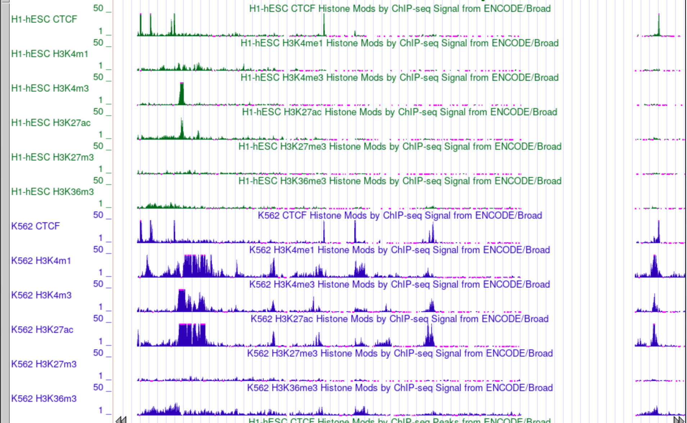

Блокнот: https://colab.research.google.com/drive/1baUS9iF-c9uy8g0YLOo7K2Pbwcbqiebo?usp=sharing

Вот bam файлы, которые я взял:

Контроль:
[wgEncodeBroadHistoneHsmmControlStdAlnRep1](http://hgdownload.cse.ucsc.edu/goldenPath/hg19/encodeDCC/wgEncodeBroadHistone/wgEncodeBroadHistoneHsmmControlStdAlnRep1.bam)

Остальные:

[wgEncodeBroadHistoneHsmmCtcfStdAlnRep1](http://hgdownload.cse.ucsc.edu/goldenPath/hg19/encodeDCC/wgEncodeBroadHistone/wgEncodeBroadHistoneHsmmCtcfStdAlnRep1.bam)

[wgEncodeBroadHistoneHsmmEzh239875AlnRep1](http://hgdownload.cse.ucsc.edu/goldenPath/hg19/encodeDCC/wgEncodeBroadHistone/wgEncodeBroadHistoneHsmmEzh239875AlnRep1.bam)

[wgEncodeBroadHistoneHsmmH2azStdAlnRep1](http://hgdownload.cse.ucsc.edu/goldenPath/hg19/encodeDCC/wgEncodeBroadHistone/wgEncodeBroadHistoneHsmmH2azStdAlnRep1.bam)

[wgEncodeBroadHistoneHsmmH3k4me1StdAlnRep1](http://hgdownload.cse.ucsc.edu/goldenPath/hg19/encodeDCC/wgEncodeBroadHistone/wgEncodeBroadHistoneHsmmH3k4me1StdAlnRep1.bam)

[wgEncodeBroadHistoneHsmmH3k4me2StdAlnRep1](http://hgdownload.cse.ucsc.edu/goldenPath/hg19/encodeDCC/wgEncodeBroadHistone/wgEncodeBroadHistoneHsmmH3k4me2StdAlnRep1.bam)

[wgEncodeBroadHistoneHsmmH3k4me3StdAlnRep1](http://hgdownload.cse.ucsc.edu/goldenPath/hg19/encodeDCC/wgEncodeBroadHistone/wgEncodeBroadHistoneHsmmH3k4me3StdAlnRep1.bam)

[wgEncodeBroadHistoneHsmmH3k9acStdAlnRep1](http://hgdownload.cse.ucsc.edu/goldenPath/hg19/encodeDCC/wgEncodeBroadHistone/wgEncodeBroadHistoneHsmmH3k9acStdAlnRep1.bam)

[wgEncodeBroadHistoneHsmmH3k9me3StdAlnRep1](http://hgdownload.cse.ucsc.edu/goldenPath/hg19/encodeDCC/wgEncodeBroadHistone/wgEncodeBroadHistoneHsmmH3k9me3StdAlnRep1.bam)

[wgEncodeBroadHistoneHsmmH3k27acStdAlnRep1](http://hgdownload.cse.ucsc.edu/goldenPath/hg19/encodeDCC/wgEncodeBroadHistone/wgEncodeBroadHistoneHsmmH3k27acStdAlnRep1.bam)

[wgEncodeBroadHistoneHsmmH4k20me1StdAlnRep1](http://hgdownload.cse.ucsc.edu/goldenPath/hg19/encodeDCC/wgEncodeBroadHistone/wgEncodeBroadHistoneHsmmH4k20me1StdAlnRep1.bam)

cellmarkfiletable.txt:

Hsmm	CtcfStdAlnRep1	CtcfStdAlnRep1.bam	ControlStdAlnRep1.bam

Hsmm	Ezh239875AlnRep1	Ezh239875AlnRep1.bam	ControlStdAlnRep1.bam

Hsmm	H2azStdAlnRep1	H2azStdAlnRep1.bam	ControlStdAlnRep1.bam

Hsmm	H3k4me1StdAlnRep1	H3k4me1StdAlnRep1.bam	ControlStdAlnRep1.bam

Hsmm	H3k4me2StdAlnRep1	H3k4me2StdAlnRep1.bam	ControlStdAlnRep1.bam

Hsmm	H3k4me3StdAlnRep1	H3k4me3StdAlnRep1.bam	ControlStdAlnRep1.bam

Hsmm	H3k9acStdAlnRep1	H3k9acStdAlnRep1.bam	ControlStdAlnRep1.bam

Hsmm	H3k9me3StdAlnRep1	H3k9me3StdAlnRep1.bam	ControlStdAlnRep1.bam

Hsmm	H3k27acStdAlnRep1	H3k27acStdAlnRep1.bam	ControlStdAlnRep1.bam

Hsmm	H4k20me1StdAlnRep1	H4k20me1StdAlnRep1.bam	ControlStdAlnRep1.bam

Табличка:

| Номер | Расшифровка | Метки |
|-|-|-|
| 1 | Active_Promoter | _ |
| 2 | Weak_Promoter | _ |
| 3 | Inactive/poised_promoter | _ |
| 4 | Strong_enhancer | _ |
| 5 | Strong_enhancer | CTCF |
| 6 | Weak/poised_enhancer | _ |
| 7 | Weak/poised_enhancer | _ |
| 8 | Insulator | H3K4m1,H3K27m3 |
| 9 | Transcriptional_transition | H3K4m3,H3K4m1 |
| 10 | Transcriptional_transition | _ |
| 11 | Weak_transcribed | CTCF,H3K4m1 |
| 12 | Polycombed_repressed | _ |
| 13 | Heterochromatin;_low_signal | _ |

Код для бонуса лежит в папке bonus.